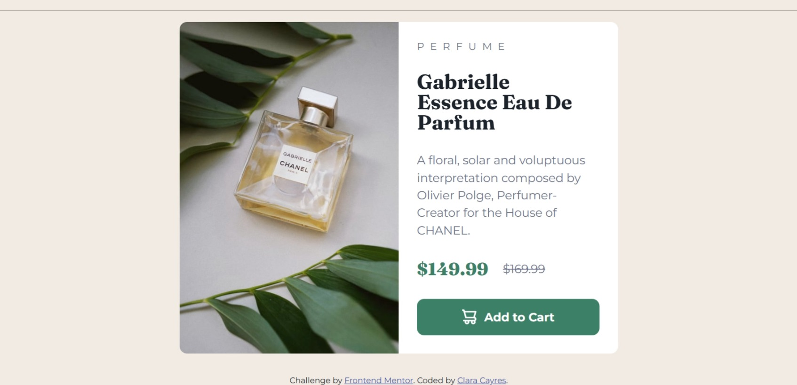
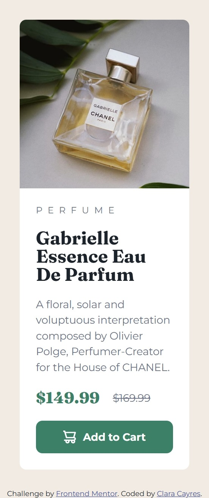

# 💄 Product Preview Card Component - Frontend Mentor Challenge

## 🚀 Overview

This is a solution for the [Product Preview Card Component Challenge](https://www.frontendmentor.io/challenges/product-preview-card-component-GO7UmttRfa) on **Frontend Mentor**. The goal was to replicate the product card layout as closely as possible using responsive HTML and CSS.

---

## ✅ The Challenge

Users should be able to:

- ✅ View the optimal layout depending on their device's screen size
- ✅ See hover and focus states for interactive elements

---

## 🖼️ Screenshot

### Desktop

### Mobile

## 

## 🔗 Links

- Repository: [GitHub](https://github.com/claracayres/product-preview-card-component-main)
- Live Site: [Live Site](https://claracayres.github.io/product-preview-card-component-main)
---

## 🛠️ Built With

- Semantic HTML5
- CSS3 with custom properties
- SCSS (Sass)
- Flexbox and CSS Grid
- Mobile-first workflow
- VS Code

---

## 💡 What I Learned

While building this project, I strengthened my understanding of:

- Using `<picture>` and `source` for responsive images
- Mobile-first styling with Flexbox and Grid
- SCSS variables for consistent theming
- Semantic HTML structure for better accessibility

## 🙋‍♀️ Author

- GitHub - [@claracayres](https://github.com/claracayres)
- Frontend Mentor - [@yourusername](https://www.frontendmentor.io/profile/claracayres)
- LinkedIn - [Your Name](https://www.linkedin.com/in/maria-clara-cayres-de-almeida)

## 🎯 Acknowledgments

Thanks to [Frontend Mentor](https://www.frontendmentor.io) for providing such amazing challenges that help developers practice real-world skills!

---